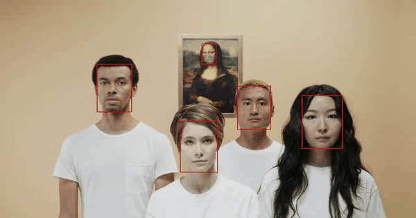

---

# 😷 Face Mask Detection System (YOLOv8 + Custom CNN)


A hybrid deep learning project that combines **YOLOv8** for fast face detection and a **Custom CNN** for mask classification. The system detects faces in real-time video, extracts the face region, and classifies it as "With Mask" or "Without Mask."

## 🖼️ Demo & Results

 

* **Green Box:** With Mask
* **Red Box:** Without Mask

## 🧠 Project Architecture

The pipeline consists of two distinct stages:

1.  **Stage 1: Face Detection (YOLOv8)**
    * Uses `yolov8nfa.pt` (Nano Face version) to detect human faces in the frame.
    * Extracts the bounding box coordinates $(x_1, y_1, x_2, y_2)$.

2.  **Stage 2: Classification (Custom CNN)**
    * The face region is cropped and preprocessed:
        * **Resizing:** $256 \times 256$ pixels.
        * **Normalization:** Pixel values scaled to $[0, 1]$.
    * Passed to a sequential CNN model trained on the Kaggle Face Mask Dataset.

### CNN Model Structure
The classifier is a lightweight sequential model built with Keras:
* **Input:** $(256, 256, 3)$
* **Conv Blocks:** 3 layers (32, 64, 128 filters) with ReLU activation and Max Pooling.
* **Regularization:** BatchNormalization and Dropout (0.1).
* **Output:** Dense layer with Sigmoid activation (Binary Classification).

## 📂 Dataset

The model was trained on the [Face Mask Dataset](https://www.kaggle.com/datasets/omkargurav/face-mask-dataset) by Omkar Gurav.
* **Total Images:** ~7,500
* **Split:** 80% Training / 20% Validation
* **Classes:** `with_mask`, `without_mask`

## 🛠️ Installation & Setup

1.  **Clone the repository:**

    ```bash
    git clone https://github.com/vishalgupta-git/face-mask-detection.git
    cd face-mask-detection
    ```

2.  **Install dependencies:**
    ```bash
    pip install -r reqirements.txt
    ```

3.  **Setup Kaggle API (For Training):**
    * Place your `kaggle.json` file in the root directory or configure your API keys to download the dataset automatically via the script.

4.  **Download Weights:**
    * Ensure `yolov8nfa.pt` is in the project root.
    * If you haven't trained the model yet, run the training script first to generate `face_mask_model.keras`.

## 🚀 Usage

### 1. Training the Model
To train the CNN from scratch:
```bash
python train.py
```

* *This will download the dataset from Kaggle, preprocess images, train the model for 30 epochs, and save `face_mask_model.keras`.*
* *It will also display accuracy and loss plots.*

### 2. Running Real-time Detection

To start the webcam detection:

```bash
python main.py
```

* *Press `q` to quit the application.*

## 📊 Performance

* **Optimizer:** Adam
* **Loss Function:** Binary Crossentropy
* **Metrics:** Accuracy

## 🤝 Contributing

Feel free to open issues or submit pull requests if you have suggestions for improving the model accuracy or the inference speed.

## 📜 License

This project is open-source and available under the MIT License.

